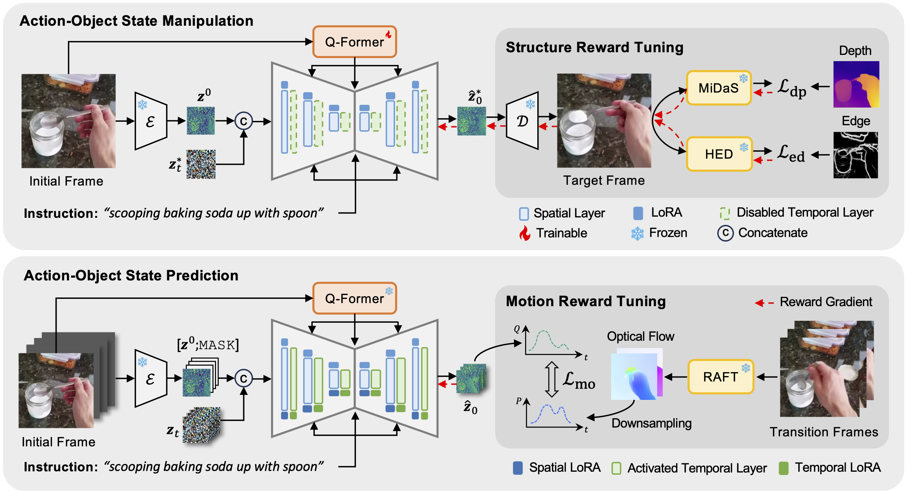

# Show Me: Unifying Instructional Image and Video Generation with Diffusion Models

This repository is the official PyTorch implementation for our WACV'26 paper:

[Show Me: Unifying Instructional Image and Video Generation with Diffusion Models](https://arxiv.org/abs/2511.17839).

Yujiang Pu, Zhanbo Huang, Vishnu Boddeti, and Yu Kong


## Method Overview

<div align="center">
  
</div>

<p align="center">
  <em>Figure 1. Overview of the ShowMe framework.</em>
</p>

## 1. Environment Setup

We recommend using **conda** to manage the environment.


```bash
conda create -n showme python=3.8.5
conda activate showme
pip install -r requirements.txt
```

## 2. Data Preparation

We provide processed data via Google Drive. Please download the data from our [Google Drive](https://github.com/yujiangpu20/ShowMe-master) folder and organize the directory structure as follows:

```bash
Data
├── somethingV2
│   ├── train_videos
│   │   ├── video_id.mp4
│   │   └── ...
│   ├── eval_videos
│   │   ├── video_id.mp4
│   │   └── ...
│   ├── ssv2-train-HOI.jsonl
│   └── ssv2-val-HOI.jsonl
│
├── epic-kitchens100
│   ├── train_frames
│   │   ├── video_id
│   │   │   ├── frame_000001.jpg
│   │   │   ├── frame_000002.jpg
│   │   │   └── ...
│   ├── val_frames
│   │   ├── video_id
│   │   │   ├── frame_000001.jpg
│   │   │   ├── frame_000002.jpg
│   │   │   └── ...
│   ├── EPIC_100_HOI_train.csv
│   └── EPIC_100_HOI_val.csv
│
└── Ego4D
    ├── train_clips
    │   ├── video_id
    │   │   ├── seg_id.mp4
    │   │   └── ...
    ├── val_clips
    │   ├── video_id
    │   │   ├── seg_id.mp4
    │   │   └── ...
    ├── ego4d_train.json
    └── ego4d_val.json
```

You may place ```Data``` anywhere on your system, but remember the absolute path; it will be used as ```data_dir``` in training and inference configs.


## 3. Model Preparation

**Base Model**: Download the pretrained checkpoint from the [DynamiCrafter](https://huggingface.co/Doubiiu/DynamiCrafter/blob/main/model.ckpt) repository.

**Fine-tuned Weights**: Download our LoRA weights from our [Google Drive](https://github.com/yujiangpu20/ShowMe-master).

Put the weights under the ```checkpoints``` directory:

```
checkpoints/
├── model.ckpt  # Pretrained DynamiCrafter base model
├── ssv2/
│   ├── lora_image.pth
│   └── lora_video.pth
├── epic100/
│   ├── lora_image.pth
│   └── lora_video.pth
└── ego4d/
    ├── lora_image.pth
    └── lora_video.pth
```

Make sure the directory names and filenames match the paths expected in your config files.


## 4. 🚀 Training

Our model follows a two-stage training strategy with reward fine-tuning. Please modify ```configs/config_train.yaml``` and ```train.sh``` to update paths to your local directory.

Launch the training script:

```
bash configs/training_256_v1.0/train.sh
```

Please refer to the comments inside for dataset and stage-specific options.

## 5. 🎬 Inference

Our model supports both image and video generation.

1. Open ```main/inference.sh```.

2. Specify the ```dataset```, ```stage```, and ```data_dir``` variables.

3. (Optional) Change the GPU ID in the script for single or multi-GPU inference.


Run the inference script:

```
bash main/inference.sh
```

## 6. 📊 Evaluation

Evaluation scripts and instructions are located in the ```evaluation/``` directory.


## 7. Acknowledgement

Our code is built upon [DynamiCrafter](https://github.com/Doubiiu/DynamiCrafter). We thank the authors for their great open-source contribution.

## 8. Citation

If you find this repository useful, please consider citing our paper:

```
@article{pu2025show,
  title={Show Me: Unifying Instructional Image and Video Generation with Diffusion Models},
  author={Pu, Yujiang and Huang, Zhanbo and Boddeti, Vishnu and Kong, Yu},
  journal={arXiv preprint arXiv:2511.17839},
  year={2025}
}
```
